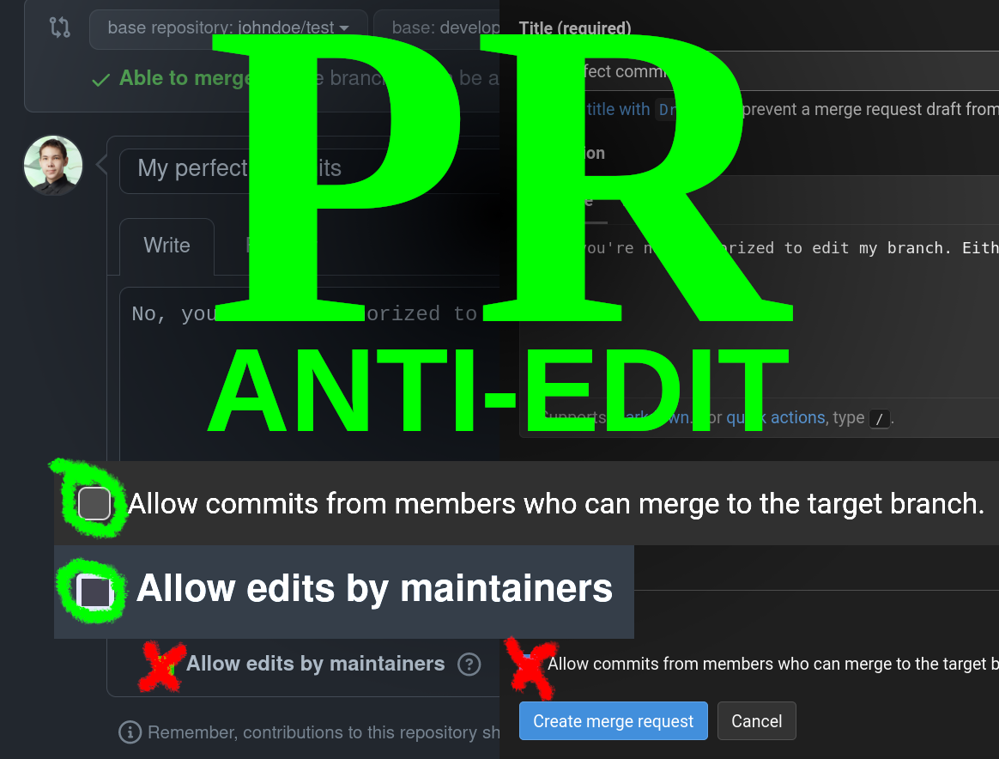

# PR Anti-Edit
Userscript that unticks the "Allow edits from maintainters" checkbox for you upon creation of pull request.

Untick checkbox allowing edits from maintainers for new pull and merge requests on GitHub and GitLab. Effectively, it prevents extraneous adding and modifying commits within your fork's branch acting as a source in PR/MR you create. May be useful to those of you who don't appreciate upstream maintainer tampering with your allegedly perfect work.

